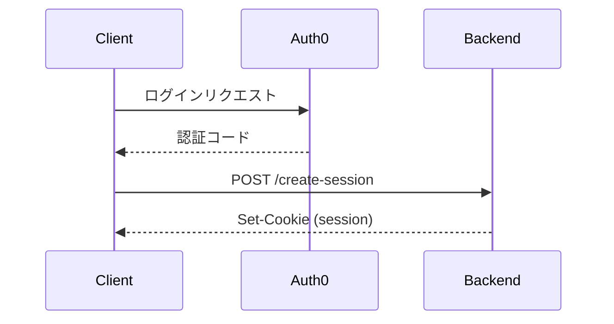
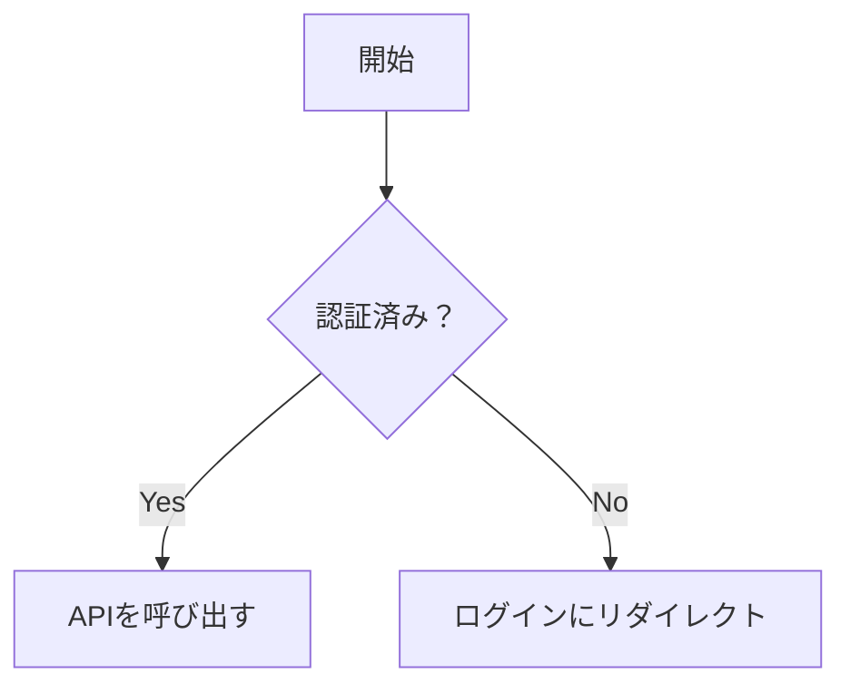
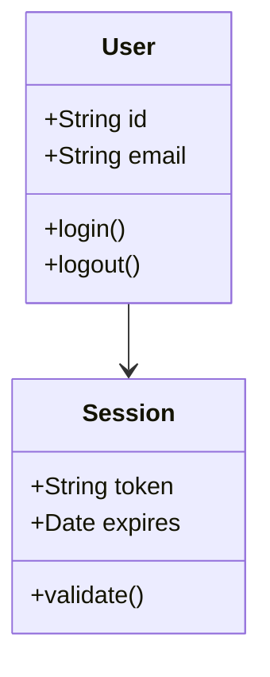
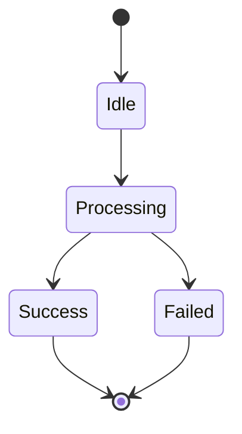
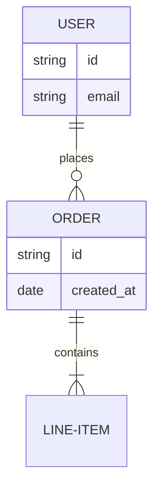

# Mermaidクリエーター

厳格な構文ルールとベストプラクティスに従った、有効でエラーのないMermaid図を生成します。

## コア原則

1. **HTMLタグ禁止** — 図のどの部分にも `<br/>`、`<br>`、その他のHTMLを使用しない
2. **スタイルディレクティブ禁止** — `style`、`fill`、`stroke`、`classDef`、色指定を使用しない
3. **シンプルなラベル** — テキストを簡潔に保ち、特殊文字は避けるか適切にエスケープする
4. **構文の検証** — 最終化前に一般的なエラーパターンを常に確認する

## クイックスタート

Mermaid図を生成する際：

1. 図のタイプを特定する（シーケンス、フローチャート、クラス、ステート、ER）
2. [syntax-guide.md](references/syntax-guide.md) のパターンのみを使用する
3. 以下の禁止パターンをすべて避ける
4. ラベルを短くシンプルに保つ

## 禁止パターン

これらは常にエラーを引き起こす — 絶対に使わない：

```mermaid
❌ participant User<br/>Browser          (HTMLタグ)
❌ A[Label<br/>with breaks]              (ラベル内のHTML)
❌ style A fill:#ff0000                  (スタイルディレクティブ)
❌ classDef myClass fill:#f9f            (色の定義)
❌ A --> B: Very long message<br/>text   (テキスト内の改行)
```

## 安全なパターン

代わりにこれらを使用する：

```mermaid
✅ participant UserBrowser as User Browser    (エイリアス)
✅ A[短いラベル]                               (簡潔なテキスト)
✅ A --> B: 簡潔なメッセージ                   (一行テキスト)
✅ Note over A,B: 説明的なメモ                 (詳細のためのメモ)
```

## 図タイプの選択

ユースケースに基づいて選択する：

- **シーケンス図**：認証フロー、API呼び出し、時系列のインタラクション
- **フローチャート**：判断ロジック、プロセス、アルゴリズム、ステップバイステップのワークフロー
- **クラス図**：オブジェクト指向設計、データ構造、型階層
- **ステート図**：ステートマシン、ステータスライフサイクル、トランジションロジック
- **ER図**：データベーススキーマ、エンティティの関係、データモデル

## 図の生成

### シーケンス図

時間経過に伴うインタラクションの表示に使用（認証フロー、API呼び出し）：



**主要ルール：**

- 読みやすいラベルには `participant X as Long Name` を使用する
- 矢印タイプ：`->`、`-->`、`->>`、`-->>` （実線/点線、矢印あり/なし）
- メッセージを簡潔に保つ（改行なし）
- 追加のコンテキストには `Note over X,Y: テキスト` を使用する

完全なシーケンス図の構文については [syntax-guide.md](references/syntax-guide.md) を参照。

### フローチャート

判断ツリーとプロセスに使用：



**主要ルール：**

- 方向：`TD`（上から下）、`LR`（左から右）、`BT`（下から上）、`RL`（右から左）
- 形状：`[]` 矩形、`()` 角丸、`{}` ダイアモンド、`[[]]` サブルーチン
- 特殊文字を含むラベルにはクォートを使用：`A["ラベル：特殊"]`

完全なフローチャートの構文については [syntax-guide.md](references/syntax-guide.md) を参照。

### クラス図

オブジェクト指向設計に使用：



**主要ルール：**

- 可視性：`+` パブリック、`-` プライベート、`#` プロテクテッド
- 関係：`<|--` 継承、`*--` コンポジション、`-->` 関連
- 型注釈をシンプルに保つ

完全なクラス図の構文については [syntax-guide.md](references/syntax-guide.md) を参照。

### ステート図

ステートマシンとライフサイクルに使用：



**主要ルール：**

- `stateDiagram-v2` を使用する（v2が現在のバージョン）
- `[*]` は開始/終了状態を表す
- ステート名に特殊文字を使用しない

完全なステート図の構文については [syntax-guide.md](references/syntax-guide.md) を参照。

### ER図

データベーススキーマに使用：



**主要ルール：**

- カーディナリティ：`||--||` 一対一、`||--o{` 一対多、`}o--o{` 多対多
- 複数単語のエンティティ名にはハイフンを使用：`USER-ACCOUNT`
- 属性タイプをシンプルに保つ

完全なER図の構文については [syntax-guide.md](references/syntax-guide.md) を参照。

## エラー防止ワークフロー

Mermaid図を最終化する前に：

1. **HTMLタグを確認** — `<br`、`<div`、または任意の `<` 文字を検索する
2. **スタイルディレクティブを確認** — `style`、`fill:`、`stroke:` を検索する
3. **ラベルを確認** — すべてのテキストが簡潔であることを確認する（手動の改行なし）
4. **特殊文字を確認** — `:`、`#`、`{}`、`[]`、`()` を含むラベルをエスケープまたはクォートする
5. **構文を検証** — syntax-guide.md のパターンと正確に一致させる

## 一般的な修正

| エラーパターン | 修正方法 |
| ------------ | ------- |
| `participant A<br/>B` | `participant AB as A B` |
| `A->>B: Long<br/>text` | `A->>B: Long text`（一行に保つ） |
| `style A fill:#f00` | 完全に削除（スタイリングなし） |
| `A[Label #1]` | `A["Label #1"]`（特殊文字をクォート） |
| `A --> B: text<br/>more` | 2つの矢印に分割するかNoteを使用 |

## リソース

### references/syntax-guide.md

以下を含む包括的な構文リファレンス：

- すべての図タイプの詳細な構文
- 例を含む一般的な落とし穴
- バリデーションチェックリスト
- 図タイプ選択のクイックリファレンス

構文の質問やエッジケースに遭遇した際にこのファイルを読み込む。
