# Mermaid構文ガイド

## 共通の構文ルール（すべての図タイプ）

### エラーを避けるための重要なルール

1. **テキスト内のHTMLタグ禁止** — `<br/>`、`<br>`、または任意のHTMLを使用しない
   - ❌ `participant User<br/>Browser`
   - ✅ `participant UserBrowser as User Browser`

2. **ラベル内の改行** — エスケープされた改行を使用するか避ける
   - ❌ `<br/>` を使った複数行テキスト
   - ✅ 短い一行ラベルを使用する

3. **特殊文字** — エスケープするか避ける：`#`、`{`、`}`、`[`、`]`、`(`、`)`
   - ❌ `A[Label with (parentheses)]`
   - ✅ `A[Label with parentheses]`

4. **スタイル/カラーディレクティブ禁止**（CLAUDE.mdより）
   - ❌ `style A fill:#ff0000`
   - ❌ `classDef myClass fill:#f9f,stroke:#333`
   - ✅ デフォルトのスタイリングのみ使用

5. **クォート** — 特殊文字を含むラベルに使用する
   - `A["Label with: special chars"]`

## シーケンス図

### 基本構文

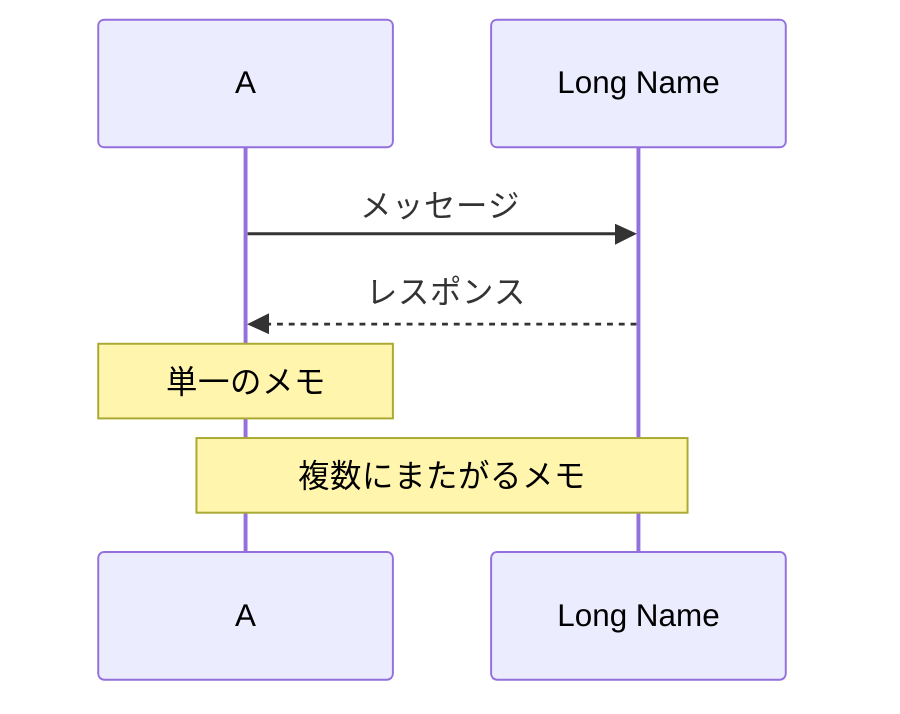

### 矢印タイプ

- `->` 矢印なしの実線
- `-->` 矢印なしの点線
- `->>` 矢印付きの実線
- `-->>` 矢印付きの点線

### 一般的な落とし穴

❌ **参加者名にbrタグを使わない：**

```mermaid
participant Auth0<br/>Server
```

✅ **代わりにエイリアスを使用する：**

```mermaid
participant Auth0 as Auth0 Server
```

❌ **メッセージにbrを使わない：**

```mermaid
A->>B: POST /token<br/>{ code: "..." }
```

✅ **メッセージを簡潔に保つ：**

```mermaid
A->>B: POST /token (code parameter)
```

### 高度な機能

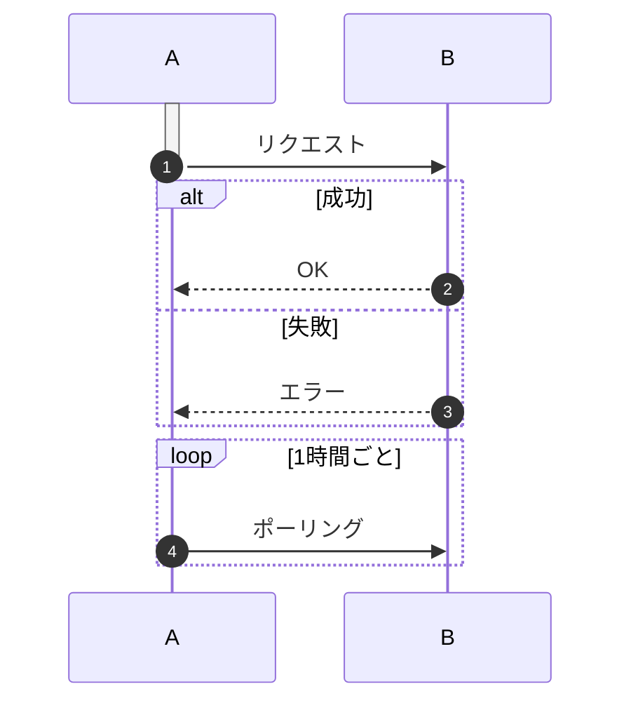

## フローチャート

### 基本構文

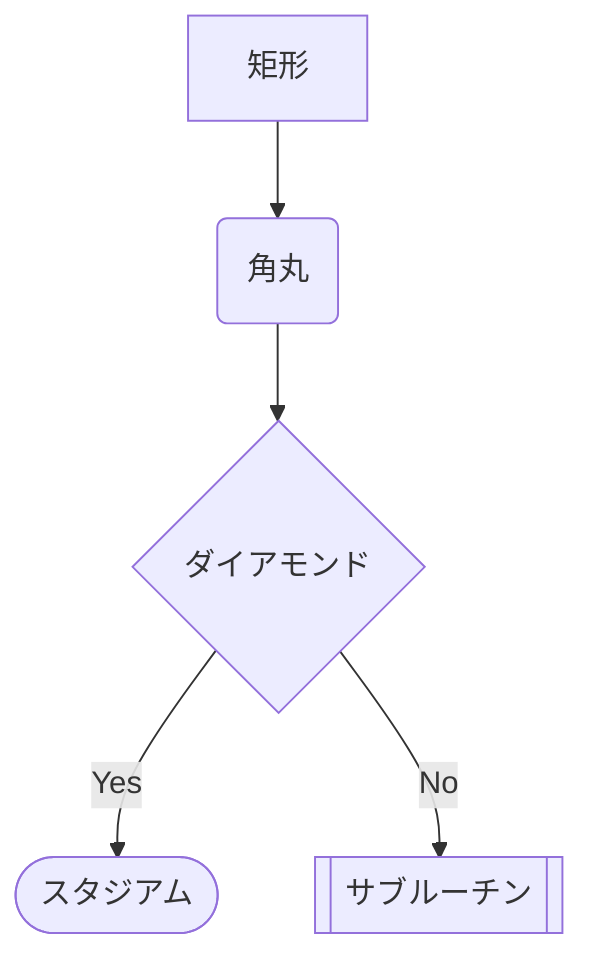

### 方向オプション

- `TD` または `TB` — 上から下
- `BT` — 下から上
- `LR` — 左から右
- `RL` — 右から左

### 一般的な落とし穴

❌ **複雑なラベルを使わない：**

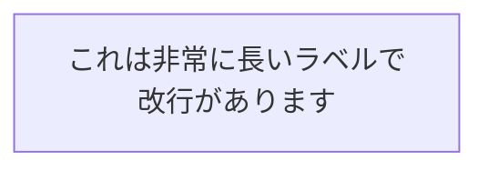

✅ **ラベルを短くする：**

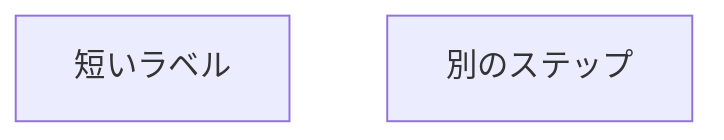

❌ **特殊文字をエスケープせずに使わない：**

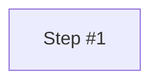

✅ **特殊文字にはクォートを使用する：**


## クラス図

### 基本構文

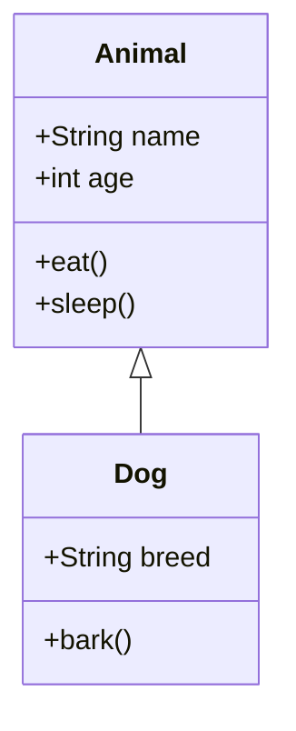

### 関係タイプ

- `<|--` 継承
- `*--` コンポジション
- `o--` 集約
- `-->` 関連
- `--` リンク（実線）
- `..>` 依存
- `..|>` 実現

### 可視性修飾子

- `+` パブリック
- `-` プライベート
- `#` プロテクテッド
- `~` パッケージ/内部

### 一般的な落とし穴

❌ **複雑な型注釈を使わない：**

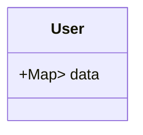

✅ **型をシンプルにする：**

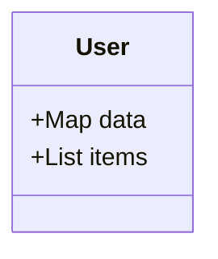

## ステート図

### 基本構文

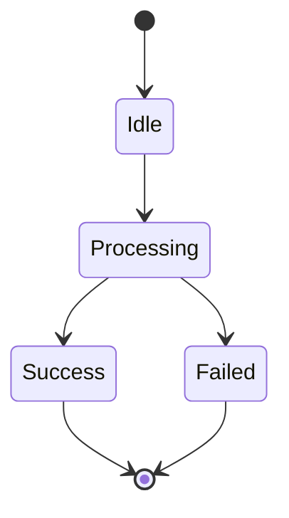

### 複合ステート

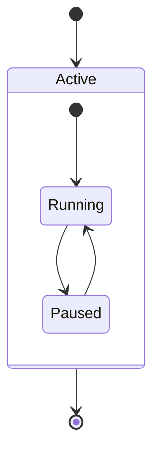

### 一般的な落とし穴

❌ **ステート名に特殊文字を使わない：**

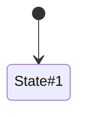

✅ **英数字の名前を使用する：**

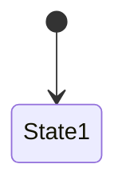

## ER図（エンティティリレーションシップ図）

### 基本構文

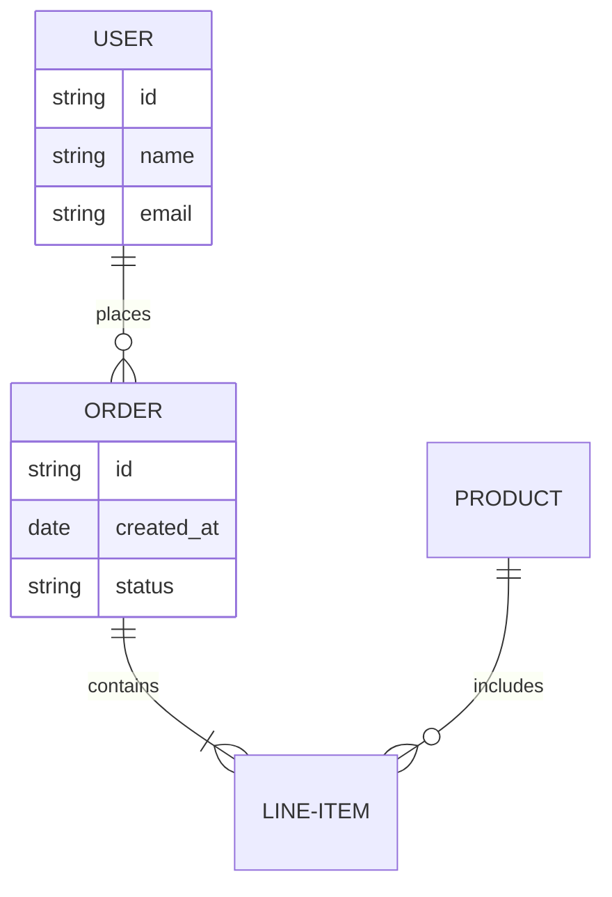

### 関係のカーディナリティ

- `||--||` 一対一
- `||--o{` 一対多
- `}o--o{` 多対多
- `||--|{` 一対正確に一

### 一般的な落とし穴

❌ **エンティティ名にスペースを使わない：**

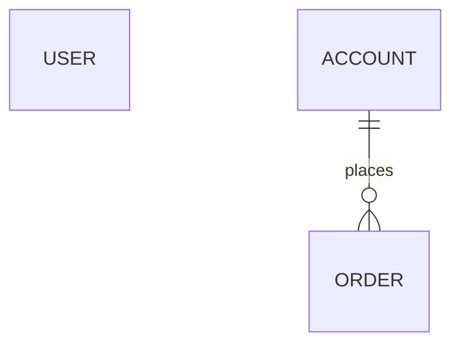

✅ **ハイフンまたはcamelCaseを使用する：**

```mermaid
erDiagram
    USER-ACCOUNT ||--o{ ORDER : places
```

## バリデーションチェックリスト

Mermaid図を最終化する前に確認する：

- [ ] どこにも `<br/>` やHTMLタグがない
- [ ] `style`、`fill`、`stroke` ディレクティブがない
- [ ] すべての参加者/ノード名がシンプル（特殊文字なし）
- [ ] 改行が避けられているか適切にエスケープされている
- [ ] 特殊文字を含むラベルにクォートが使用されている
- [ ] 図のタイプがユーザーの要件に合っている
- [ ] 構文が上記のパターンに正確に従っている

## クイックリファレンス：各図タイプの使用場面

- **シーケンス**：時系列のインタラクション、APIフロー、認証フロー
- **フローチャート**：判断ツリー、プロセス、アルゴリズム
- **クラス**：オブジェクト指向設計、データ構造
- **ステート**：ステートマシン、ライフサイクル管理
- **ER**：データベーススキーマ、データの関係
